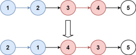
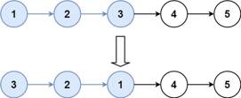

Given the `head` of a linked list, reverse the nodes of the list `k` at a time, and return *the modified list*.`k` is a positive integer and is less than or equal to the length of the linked list. If the number of nodes is not a multiple of `k` then left-out nodes, in the end, should remain as it is.

**Example 1:**



```
Input: head = [1,2,3,4,5], k = 2
Output: [2,1,4,3,5]
```

**Example 2:**


```
Input: head = [1,2,3,4,5], k = 3
Output: [3,2,1,4,5]
```

