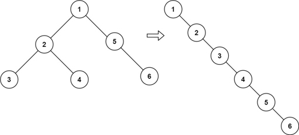

Given the `root` of a binary tree, flatten the tree into a "linked list":

- The "linked list" should use the same `TreeNode` class where the `right` child pointer points to the next node in the list and the `left` child pointer is always `null`.
- The "linked list" should be in the same order as a [**pre-order** **traversal**](https://en.wikipedia.org/wiki/Tree_traversal#Pre-order,_NLR) of the binary tree.

**Example 1:**



```
Input: root = [1,2,5,3,4,null,6]
Output: [1,null,2,null,3,null,4,null,5,null,6]
```

